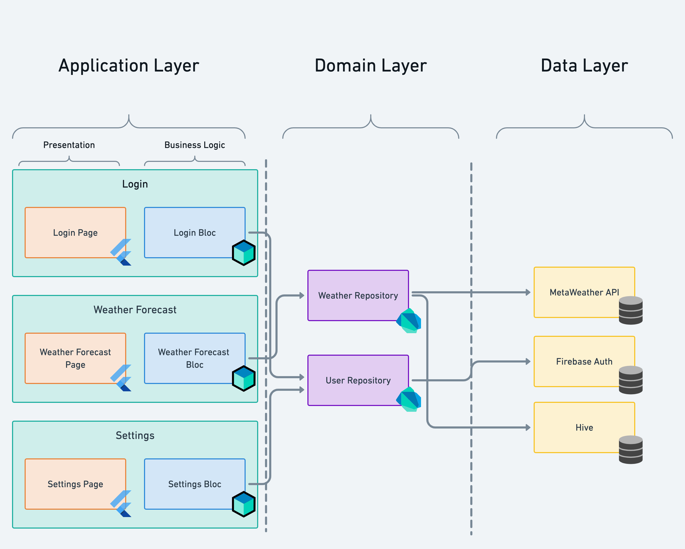

# Vg Tarabish Flame

![coverage][coverage_badge]
[![style: very good analysis][very_good_analysis_badge]][very_good_analysis_link]
[![License: MIT][license_badge]][license_link]

Generated by the [Very Good CLI][very_good_cli_link] 🤖

A Very Good Project created by Very Good CLI.

---

## Getting Started 🚀

This project contains 3 flavors:

- development
- staging
- production

To run the desired flavor either use the launch configuration in VSCode/Android Studio or use the following commands:

```sh
# Development
$ flutter run --flavor development --target lib/main_development.dart

# Staging
$ flutter run --flavor staging --target lib/main_staging.dart

# Production
$ flutter run --flavor production --target lib/main_production.dart
```

_\*Vg Tarabish Flame works on iOS, Android, Web, and Windows._

---

## Running Tests 🧪

To run all unit and widget tests use the following command:

```sh
$ flutter test --coverage --test-randomize-ordering-seed random
```

To view the generated coverage report you can use [lcov](https://github.com/linux-test-project/lcov).

```sh
# Generate Coverage Report
$ genhtml coverage/lcov.info -o coverage/

# Open Coverage Report
$ open coverage/index.html
```

---

## Working with Translations 🌐

This project relies on [flutter_localizations][flutter_localizations_link] and follows the [official internationalization guide for Flutter][internationalization_link].

### Adding Strings

1. To add a new localizable string, open the `app_en.arb` file at `lib/l10n/arb/app_en.arb`.

```arb
{
    "@@locale": "en",
    "counterAppBarTitle": "Counter",
    "@counterAppBarTitle": {
        "description": "Text shown in the AppBar of the Counter Page"
    }
}
```

2. Then add a new key/value and description

```arb
{
    "@@locale": "en",
    "counterAppBarTitle": "Counter",
    "@counterAppBarTitle": {
        "description": "Text shown in the AppBar of the Counter Page"
    },
    "helloWorld": "Hello World",
    "@helloWorld": {
        "description": "Hello World Text"
    }
}
```

3. Use the new string

```dart
import 'package:vg_tarabish_flame/l10n/l10n.dart';

@override
Widget build(BuildContext context) {
  final l10n = context.l10n;
  return Text(l10n.helloWorld);
}
```

### Adding Supported Locales

Update the `CFBundleLocalizations` array in the `Info.plist` at `ios/Runner/Info.plist` to include the new locale.

```xml
    ...

    <key>CFBundleLocalizations</key>
	<array>
		<string>en</string>
		<string>es</string>
	</array>

    ...
```

### Adding Translations

1. For each supported locale, add a new ARB file in `lib/l10n/arb`.

```
├── l10n
│   ├── arb
│   │   ├── app_en.arb
│   │   └── app_es.arb
```

2. Add the translated strings to each `.arb` file:

`app_en.arb`

```arb
{
    "@@locale": "en",
    "counterAppBarTitle": "Counter",
    "@counterAppBarTitle": {
        "description": "Text shown in the AppBar of the Counter Page"
    }
}
```

`app_es.arb`

```arb
{
    "@@locale": "es",
    "counterAppBarTitle": "Contador",
    "@counterAppBarTitle": {
        "description": "Texto mostrado en la AppBar de la página del contador"
    }
}
```

### Generating Translations

To use the latest translations changes, you will need to generate them:

1. Generate localizations for the current project:

```sh
flutter gen-l10n --arb-dir="lib/l10n/arb"
```

Alternatively, run `flutter run` and code generation will take place automatically.

[coverage_badge]: coverage_badge.svg
[flutter_localizations_link]: https://api.flutter.dev/flutter/flutter_localizations/flutter_localizations-library.html
[internationalization_link]: https://flutter.dev/docs/development/accessibility-and-localization/internationalization
[license_badge]: https://img.shields.io/badge/license-MIT-blue.svg
[license_link]: https://opensource.org/licenses/MIT
[very_good_analysis_badge]: https://img.shields.io/badge/style-very_good_analysis-B22C89.svg
[very_good_analysis_link]: https://pub.dev/packages/very_good_analysis
[very_good_cli_link]: https://github.com/VeryGoodOpenSource/very_good_cli


rxdart

https://medium.com/@NALSengineering/introduction-to-rxdart-subjects-9cca71dd4bf0

bloc concurrency

https://verygood.ventures/blog/how-to-use-bloc-with-streams-and-concurrency

flutter run --flavor development --target lib/main_development.dart -d chrome --web-renderer canvaskit

on cloud shell
git clone https://github.com/iggymacd/vg-tarabish-flame.git
cd vg-tarabish-flame/
git config --global --add safe.directory /google/flutter
flutter run --flavor development --target lib/main_development.dart -d web-server --web-port=5555 --web-renderer canvaskit
dart run build_runner watch


Architecture will be based on data, domain and presentation

Loosely based on info at https://verygood.ventures/blog/very-good-flutter-architecture



Example structure

├── lib
|   ├── games
│   │   ├── bloc
│   │   │   └── game_bloc.dart
|   |   |   └── game_event.dart
|   |   |   └── game_state.dart
|   |   └── models
|   |   |   └── models.dart
|   |   |   └── game.dart
│   │   └── view
│   │   |   ├── games_page.dart
│   │   |   └── games_list.dart
|   |   |   └── view.dart
|   |   └── widgets
|   |   |   └── bottom_loader.dart
|   |   |   └── game_list_item.dart
|   |   |   └── widgets.dart
│   │   ├── games.dart
│   ├── app.dart
│   ├── simple_bloc_observer.dart
│   └── main.dart
├── pubspec.lock
├── pubspec.yaml
